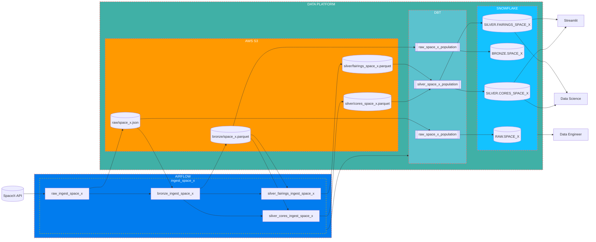

# spacex-data-platform

[](https://github.com/pre-commit/pre-commit)
[](https://github.com/astral-sh/ruff)
[](http://mypy-lang.org/)
[](https://interrogate.readthedocs.io/en/latest/)
[](https://codecov.io/gh/Darth-ATA/spacex-data-platform)
[](https://spacex-data-platform-4abww5mtqfbsndzaugjthk.streamlit.app/)

Automate the build of a simple yet scalable Data Platform.

The application is available at [spacex-data-platform](https://spacex-data-platform-4abww5mtqfbsndzaugjthk.streamlit.app/).

Here you can choose the data you want to see and query against it.

## Requirements

- Python 3.10
- [Poetry](https://python-poetry.org)

## Project Structure

### Ingestion

This module is responsible for ingesting data from the SpaceX API.

#### [Raw](spacex_data_platform/ingestion/raw)

This module is responsible for storing the raw data from the SpaceX API. We do this to ensure that we have a copy of the data as it was at the time of ingestion.

#### [Bronze](spacex_data_platform/ingestion/bronze)

This module is responsible for transforming the raw data from the SpaceX API to a more structured format. We are transforming the data from `json` to `parquet`. Also in this layer, we are adding the `create_date` and `provider_code` columns. For having traceability of the data if we to know when the data was ingested and from where.

#### [Silver](spacex_data_platform/ingestion/silver)

This module is responsible for transforming the bronze data to a more data platform format. We are transforming the data from `parquet` to `parquet`. In this layer, if we have any data quality issues, we are going to raise an exception.
Also this would be the layer where multiple data sources are combined.

##### [Fairings](spacex_data_platform/ingestion/silver/fairings_data.py)

It takes from `SpaceX` the information about `Fairings`.

We are doing the Data Quality checks We are doing the Data Quality checks [fairings_data.py](spacex_data_platform/ingestion/silver/schemas/fairings_data.py)::

- Check if `create_date_format` format 'YYYY-MM-DDTHH:MM:SS'
- Check if `static_fire_date_utc_format` format 'YYYY-MM-DDTHH:MM:SS'
- Check if `date_utc_format` format 'YYYY-MM-DDTHH:MM:SS.mmmZ'
- Check if `date_local_format` format 'YYYY-MM-DDTHH:MM:SS+-HH:MM'

This is the central piece of data from where we are going to reproduce the data.

##### [Cores](spacex_data_platform/ingestion/silver/cores_data.py)

It takes from `SpaceX` the information about `Cores`. Each `Fairing` could have multiple `Cores`.

We are doing the Data Quality checks [cores_flights.py](spacex_data_platform/ingestion/silver/schemas/cores_flights.py):

- Check if the combination of 'id' and 'core' is unique
- If landing_attempt is True, landing_success, landpad and landing_type must be filled. Except if landing_type is 'Ocean' (We need to check why are we considering this a success)
- If core is reused, flight must be bigger than 1
- Check if `create_date_format` format 'YYYY-MM-DDTHH:MM:SS'

#### [Gold](spacex_data_platform/ingestion/gold)

Right now Gold and Silver are the same as we do not have multiple data sources. Or any other transformation that we need to do.

But here, we would do transformations where we select which data point we want if is repeated for different provider.
Also any other transformation thata Data Scientist or Product ask us for doing the work easier.

### [Data Platform Simulator](spacex_data_platform/data_visualization/run.py)

As we do not have a real data platform, we are going to simulate it.
We are going to use the `Silver` data to simulate the data platform in combination with [Streamlit](https://streamlit.io) and [DuckDB](https://duckdb.org/). We are going to create a simple web application where we can see the data and query against it with `DuckDB`.

- Each time a rocket is launched, one or more cores (first stages) are involved. Sometimes, cores are recovered after the launch and reused posteriorly in another launch. What is the maximum number of times a core has been used? Write an SQL query to find the result.
- Which cores have been reused in less than 50 days after the previous launch? Write an SQL query to find the result.
- List the months in which there has been more than one launch. Write an SQL query to find the results.

## End architecture

All we have created is a simple architecture that tries to simulate end2end ingestion into a data platform.

The final architecture would be something like this:



We are going to orchestrate all the process with [Airflow](https://airflow.apache.org/).

1. We are going to execute the end2end ingestion using the `DAG` `ingest_space_x`, this is just a trigger to execute the following:
    - `raw_ingest_space_x` that is going to ingest the data in raw from the `SpaceX API` executing [Raw](#### Raw).
    - `bronze_ingest_space_x` is going to execute [Bronze](#### Bronze).
    - `silver_fairings_ingest_space_x` is going to execute [Fairings](##### Fairings).
    - `silver_cores_ingest_space_x` is going to execute [Cores](##### Cores).
2. After all this process, we will have available in `S3` the data in the `parquet` format. Now we are going to make use of [DBT](https://www.getdbt.com) to populate the data in [Snowflake](https://www.snowflake.com/en/).
3. Once we have the data in `Snowflake`, `Data Science` and `Streamlit` will have only access to `Silver` data, and `Data Engineer` will have access to all the data.

About the frequency of the execution of the `DAG`, exploring the `SpaceX` data I conclude that once a day is enough.
Anyway we could create a mechanism for ingesting the data using events.

For the moment we only have `Fairings` and `Cores` data. Because the question related, only involved this data.
But there are information about `links`, `failures`, `crew` that will deserve the same treatment as we did for `Fairings` and `Cores`.

We did not create the `Gold` layer because we do not have multiple data sources and we did not have conversations with the users for tailoring more the data for their purpose.

## Setup Locally

To set up the project locally, follow these steps:

1. Install the project dependencies:

    ```bash
    poetry install
    ```

2. Activate the virtual environment:

    ```bash
    poetry shell
    ```

3. Install the [pre-commit](https://pre-commit.com) hooks (for code formatting and linting):

    ```bash
    pre-commit install
    ```

We are using [Conventional Commits](https://www.conventionalcommits.org/en/v1.0.0/) for commit messages. To enforce this, we are using a `pre-commit hook` that will ensure your commits are following the conventional commits format.

You can run locally streamlit with the following command:

```bash
streamlit run spacex_data_platform/data_visualization/run.py
```

The web will be deployed at `http://localhost:8502/`.
